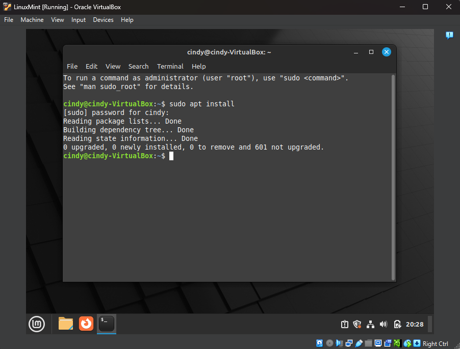
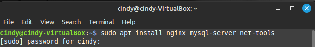

# Linux Mint Package Setup

This README documents the process of installing essential packages on your Linux Mint 21.1 VM.

---

## 🔄 Step 1: Update Package Repository

Before installing any new software, update your system’s package repository:

```bash
sudo apt update
```

📷 Screenshot:


---

## 📦 Step 2: Install Required Packages

Install the following software using the command below:

* **Nginx Web Server** – A lightweight, high-performance web server used to serve websites and web applications.
* **MySQL Database Server** – A popular open-source relational database system, often used in web development.
* **net-tools** – A collection of legacy networking tools (like `ifconfig`, `netstat`, etc.), useful for diagnostics.

```bash
sudo apt install nginx mysql-server net-tools
```

📷 Screenshot:


---

## ✅ Summary

These packages are commonly used for web hosting, networking diagnostics, and database management. This setup helps prepare your Linux Mint VM for server-related development, testing, or coursework.
