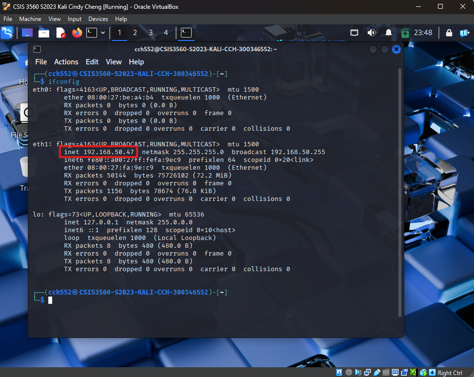
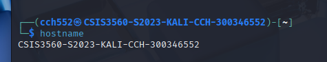
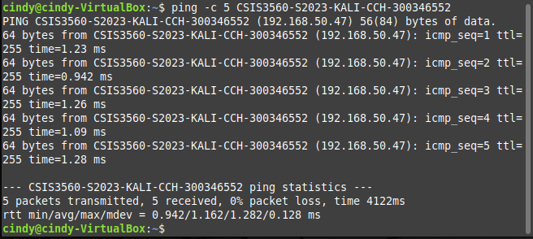
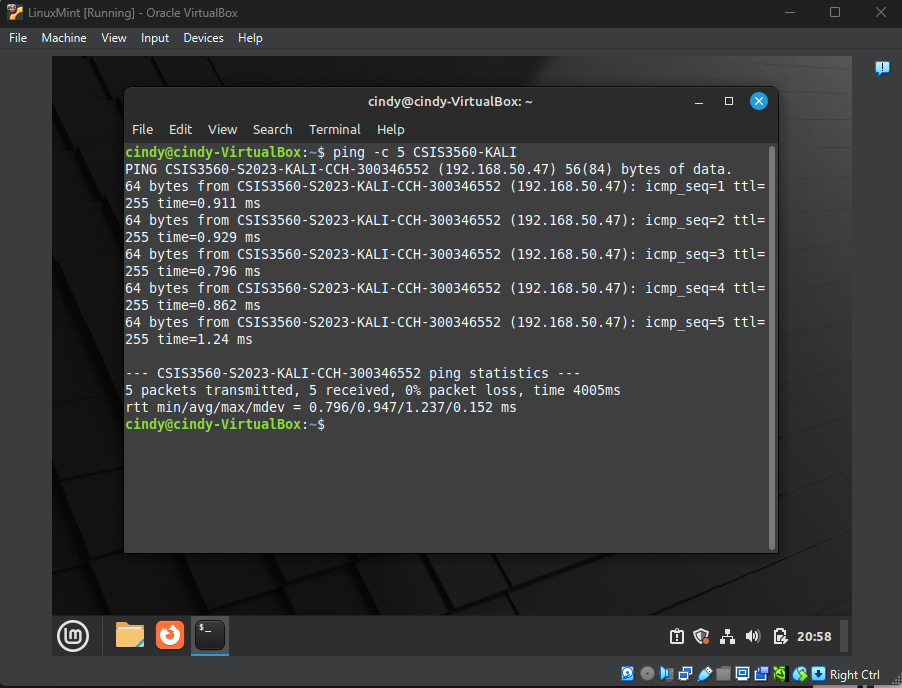

# Linux Mint Package Setup

This README documents how to test basic connectivity between your Linux Mint and Kali VMs.

---

## 🌐 Step 1: Verify VM-to-VM Connectivity

### 🔍 1. Get the Kali VM’s IP Address

On the Kali VM, install `net-tools` if not already available, then run:

```bash
sudo apt install net-tools
ifconfig
```

Record the IP address of `eth1` (e.g., `192.168.50.47`).
* 

Record the hostname
* 

### 🛠️ 2. Edit `/etc/hosts` on Linux Mint

On the Linux Mint VM, modify the `/etc/hosts` file to map Kali’s hostname and alias:

```bash
sudo vi /etc/hosts
```

📷 Screenshots:

* 

Add a line like:

```
192.168.50.47 CSIS3560-S2023-KALI-CCH-300346552 CSIS3560-KALI
```

📷 Screenshots:

* 

This lets you refer to the Kali VM using either its full hostname or a short alias.

### 📶 3. Ping the Kali VM by Hostname and Alias

Ping the Kali VM from Linux Mint to verify the connection:

```bash
ping -c 5 CSIS3560-S2023-KALI-CCH-300346552
ping -c 5 CSIS3560-KALI
```

📷 Screenshots:

* 
* 

---

## ✅ Summary

You’ve successfully:

* Retrieved Kali VM’s IP address and configured `/etc/hosts` on Mint.
* Verified name resolution and VM-to-VM network connectivity using hostname and alias.

This configuration enables further service integration and testing between VMs in your virtual lab environment.
